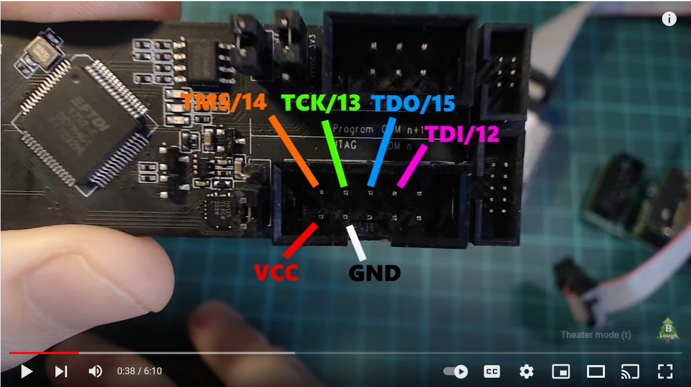

# On Device Debugging

These instructions are for how to debug the C/C++ code running Micropython and the microlite module on device.

It doesn't help with debugging the micropython program itelf.  Once https://github.com/mocleiri/tensorflow-micropython-examples/issues/10
is implemented the program can be debugged using a regular python ide.

# General Information

This documentation was written for running Visual Studio Code inside of the windows subsystem for linux in Windows 10
and having it communicate with something in Windows which is talking to the development board plugged in via USB.

Identify the IP address for the windows side from the windows subsystem for linux.  

```
cat /etc/resolv.conf

# This file was automatically generated by WSL. To stop automatic generation of this file, add the following entry to /etc/wsl.conf:
# [network]
# generateResolvConf = false
nameserver 172.24.176.1
```

In this case you need to edit the VS Code launcher with **172.24.176.1** 

This IP changes each time your computer restarts.

There are ways to configure visual studio code to be able to compile your code which are outside the scope of this 
documentation.

Here you will have to go to the board directory and then build the firmware, flash your device with the latest and
then you are at the point where these debugging instructions come in to run that firmware on the device step by step.

# ESP32

Using the ESP-PROG external JTAG board.

https://docs.espressif.com/projects/espressif-esp-iot-solution/en/latest/hw-reference/ESP-Prog_guide.html


Credit: Brian Lough https://www.youtube.com/watch?v=TivyIFF-dzw


1. Install esp-idf in windows.
2. Then run: openocd -f board/esp32-wrover-kit-3.3v.cfg -c “bindto 0.0.0.0”
3. Then disable the firewall in an admin windows powershell: ```Set-NetFirewallProfile -DisabledInterfaceAliases "vEthernet (WSL)"```

```json
{
"name": "Debug ESP32 WROOM",
"type": "cppdbg",
"request": "launch",
"program": "${workspaceFolder}/boards/esp32/MICROLITE/build/micropython.elf",
"args": [],
"miDebuggerPath": "<<normally the home directory of the user running vs code>>/.espressif/tools/xtensa-esp32-elf/esp-2020r3-8.4.0/xtensa-esp32-elf/bin/xtensa-esp32-elf-gdb",
"miDebuggerServerAddress": "<<windows IP address>>:3333",
"stopAtEntry": true,
"stopAtConnect": false,
"cwd": "${workspaceFolder}",
"environment": [],
"externalConsole": false,
"MIMode": "gdb"
}
```

# STM32

Basics:
1. Run stlink gdb in windows
2. Find IP of windows subsystem for linux
3. connect to stlink gdb in windows through TCP using IP found above.

If your board is restarting and you want to know the path to the failure then enable fault mode:

```
pyb.fault_debug(1)
```

This will hold the microcontroller at the point where there failure/reset occurred and let you see the stack trace.

Details:

Install the STM32CubeIDE.  Within it there is an stlink gdb server.  You can run this and it will connect to the board
through st link in windows and then be available for remote connections from the windows subsystem for linux:
```shell

c:\ST\STM32CubeIDE_1.7.0\STM32CubeIDE\plugins\com.st.stm32cube.ide.mcu.externaltools.stlink-gdb-server.win32_2.0.0.202105311346\tools\bin>ST-LINK_gdbserver.exe -p 3333 -l 31 -cp c:\ST\STM32CubeIDE_1.7.0\STM32CubeIDE\plugins\com.st.stm32cube.ide.mcu.externaltools.cubeprogrammer.win32_2.0.0.202105311346\tools\bin -d -v
```

```json
{
            "cwd": "${workspaceFolder}",
            "executable": "boards/stm32/NUCLEO_H743ZI2_MICROLITE/build/firmware.elf",
            "name": "Debug STM32H743ZI2",
            "armToolchainPath": "/opt/gcc-arm-none-eabi-10-2020-q4-major/bin",
            "request": "attach",
            "runToMain": true,
            "type": "cortex-debug",
            "servertype": "external",
            "device": "STM32H743ZI2Tx",
            "demangle": true,
            "svdFile": "boards/stm32/NUCLEO_H743ZI2_MICROLITE/STM32H743x.svd",
            "gdbTarget": "<< windows IP>>:3333",
            "symbolLoadInfo": {
                "loadAll": true,
                "exceptionList": ""
            }
        }
```
