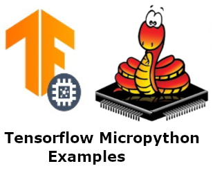
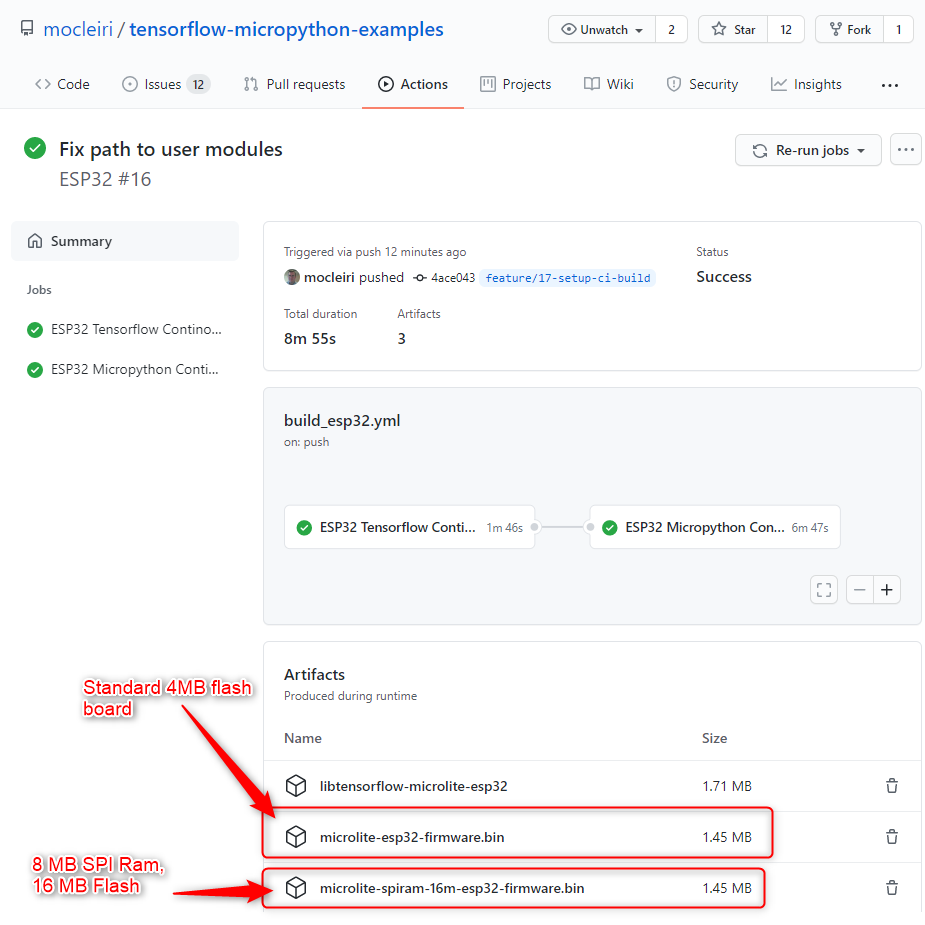
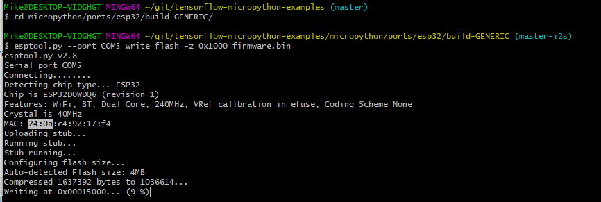

<p align="center">
    
</p>

# Tensorflow Micropython Examples

The purpose of this project is to make a custom micropython firmware that installs tensorflow lite for micro controllers
and allows for experimentation.

## Architecture

This project is a micropython module built using the USER_C_MODULES extension mechanism.  There are several modules:
* microlite
* ulab
* modcamera (for the person_detection example)

There are 4 top level git submodules:
* tensorflow lite micro
* micropython
* ulab
* tflm_esp_kernels

tflite-micro sources are generated within the microlite module at build time using the tensorflow lite example generator.

The microlite module has several types:
* tensor
* interpreter
* audio_frontend (used for the micro_speech example)

# Port Status

Build Type | Status |
 --------- | ------ |
ESP32   | [](https://github.com/mocleiri/tensorflow-micropython-examples/actions/workflows/build_esp32.yml) |
ESP32 S3   | [](https://github.com/mocleiri/tensorflow-micropython-examples/actions/workflows/build_esp32s3.yml) |
RP2     | [](https://github.com/mocleiri/tensorflow-micropython-examples/actions/workflows/build_rp2.yml) |
STM32   | Doesn't Work |
UNIX   | [](https://github.com/mocleiri/tensorflow-micropython-examples/actions/workflows/build_unix.yml) |


## Prebuilt Firmware

The latest firmware can be downloaded from the applicable build above (in the Status section).
1. Click on build status link.
2. Click on the latest green build
3. Review the available artifacts for download

You do need to be careful to get the proper firmware for your board.  If your board is not currently being built please 
file an issue and it can be added.

Also be sure that you are getting the most recent boards build from the **main** branch.  There are builds from other feature branches but many, especially those related to optional ops, are broken even if it looks like the build worked properly.



# Recent Changes

## STM32 Port Fixed 2022-01-02

The STM32 port works for hello_world now.

At the moment the build is specific to my Nucleo H743ZI2 board but I think can be generalized for many other STM32 boards.  

Please file an issue if you would like to have a build added for your board.

## Build Process Changed 2021-12-15

[#36](https://github.com/mocleiri/tensorflow-micropython-examples/issues/36) moved the audio_frontend from a seperate 
module into a type within the microlite module.

# Building from Scratch

The steps to build are self documented within the github actions used to build the firmware
for the various supported boards.  Look with the .github/workflows/ directory to see the
pipeline scripts for each board.

Issues are welcomed to request adding ci support for new boards.

Follow the [Upgrade Instructions](UPGRADE.md) on how to upgrade.  The main issue is to get the
3 git submodules updated to the latest values.

Follow the [Linux Build Instructions](BUILD.md) on how to build the latest firmware from a fresh clone
of this repository.

# Examples

The goal of this project is for experimenting with TinyML and the plan is to have 
micropython implementations of the [examples from the tensorflow micro project](https://github.com/tensorflow/tflite-micro/tree/main/tensorflow/lite/micro/examples).

In all cases the model.tflite can be used from upstream.  However its common for us to have
different implementation code written in micropython instead of C++.

Pull requests are welcome for additional examples with custom models.

| TF Micro Example Reference Examples                                                                                                | Training                                                                                                                               |
|------------------------------------------------------------------------------------------------------------------------------------|----------------------------------------------------------------------------------------------------------------------------------------|
| [hello_world](https://github.com/tensorflow/tflite-micro/blob/main/tensorflow/lite/micro/examples/hello_world/README.md)           | [Train Hello World](https://github.com/tensorflow/tflite-micro/blob/main/tensorflow/lite/micro/examples/hello_world/train/README.md)   |
| [magic_wand ](https://github.com/tensorflow/tflite-micro/blob/main/tensorflow/lite/micro/examples/magic_wand/README.md)            | [Train Magic Wand](https://github.com/tensorflow/tflite-micro/blob/main/tensorflow/lite/micro/examples/magic_wand/train/README.md)     |                                                                                                                  |
| [micro_speech](https://github.com/tensorflow/tflite-micro/blob/main/tensorflow/lite/micro/examples/micro_speech/README.md)         | [Train Micro Speech](https://github.com/tensorflow/tflite-micro/tree/main/tensorflow/lite/micro/examples/micro_speech/train/README.md) |
| [person_detection](https://github.com/tensorflow/tflite-micro/blob/main/tensorflow/lite/micro/examples/person_detection/README.md) | [Train Person Detection](https://github.com/tensorflow/tflite-micro/blob/main/tensorflow/lite/micro/examples/person_detection/training_a_model.md)                                                                                                             |

## Hello World

Give a model an x value and it will give a y value.  The chart of such points is an approximate sine wave:


Status:
* Works on unix port and esp32 port.

[Hello-World Documentation](examples/hello-world/README.md)

## Micro Speech 

Process:
1. Sample Audio
2. Convert to spectrogram
3. Set 1960 bytes on input tensor corresponding to 1 second worth of spectrogram.
4. Run inference on model 3-4 times per second and average scores.
5. Scores over 200 indicate a match

Status:
* Works on unix port with files.
* Works on esp32 no-spi ram board with machine.I2S.

[Micro Speech Documentation](examples/micro-speech/README.md)

### ESP32 Example

[ESP32 Example with INMP441 Microphone](examples/micro-speech/esp32/README.md)

### ESP32 Demo

[](https://youtu.be/FBUwIvzNVd4)


## Person Detection

Process:
1. Capture Images
2. Convert to 96x96 pixel int8 greyscale images
3. Set on input later of model
4. Run inference on image
5. if person > no person it thinks the image is a person
6. if no person > person it thinks the image contains no person

Status:
* Works on unix port and esp32 port using files.

[Person Detection Documentation](examples/person_detection/README.md)

## Magic Wand

[TODO #5](https://github.com/mocleiri/tensorflow-micropython-examples/issues/5)

# About Tensorflow

At the moment we are using the **main** branch in the
[tensorflow lite micro repository](https://github.com/tensorflow/tflite-micro).

This is the C++ api version of tensorflow lite designed to run on microcontrollers.

# About Micropython

We are building from micropython **master** branch.  

# Flash image

ESP32D0WDQ6 4MB Flash

Download the firmware from the latest ci build.

The zip file contains:
1. The bootloader
2. The partition table
3. The firmware

## Flash from Windows 
```
 esptool.py -p COM5 -b 460800 --before default_reset --after hard_reset --chip esp32 write_flash --flash_mode dio --flash_size detect --flash_freq 40m 0x1000 bootloader/bootloader.bin 0x8000 partition_table/partition-table.bin 0x10000 micropython.bin
```



## Flash for Linux

TODO 

# Credits

## Mike Teachman for I2S micropython implementation for ESP32, STM32 and RP2

The Micropython I2S implementation was written by [Mike Teachman](https://github.com/miketeachman/micropython-i2s-examples) 
and its because of his hard work that the micro-speech example works so well.

## Open MV

As far as I am aware OpenMV (https://openmv.io/) was the first micropython firmware to support tensorflow.  

I copied extensively from their approach to get inference working in the hello world example and also for micro-speech example.

I started from their libtf code for how to interact with the Tensorflow C++ API from micropython:

https://github.com/openmv/tensorflow-lib/blob/343fe84c97f73d2fe17a0ed23540d06c782fafe7/libtf.cc
and
https://github.com/openmv/tensorflow-lib/blob/343fe84c97f73d2fe17a0ed23540d06c782fafe7/libtf.h 

The audio-frontend module originated by looking at how openmv connected to the tensorflow microfrontend here:
https://github.com/openmv/openmv/blob/3d9929eeae563c5b370ac86afa9216df50f0c079/src/omv/ports/stm32/modules/py_micro_speech.c
