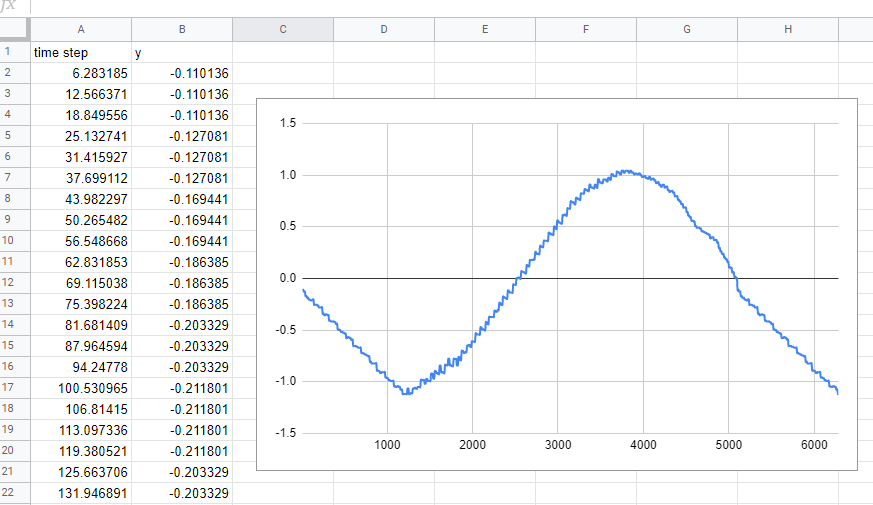
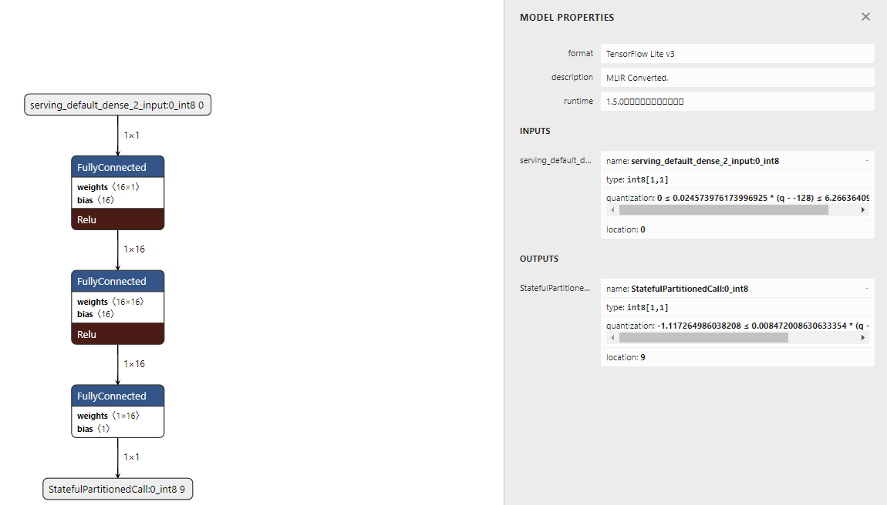
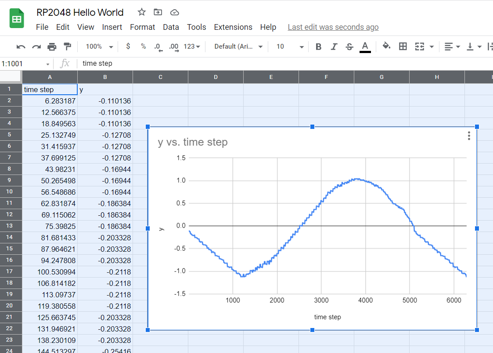

# Tensorflow Lite for Microcontrollers Hello World Example

The hello-world example generates an approximate sine wave
https://github.com/tensorflow/tflite-micro/tree/main/tensorflow/lite/micro/examples/hello_world



You provide an x value and then the model predicts what the y value should be.  The model in this case 
has been trained to return a sine wave shape.

The C++ version shows how you can convert from float to int8 on the input tensor and int8 to float on 
the output tensor.  At the moment there are equivelant methods but you need to invoke manually.  
I may be able to [automatically quantitize](https://github.com/mocleiri/tensorflow-micropython-examples/issues/6) because we can know the tensor type and the current 
micropython type. 

# Model Architecture



## Unix Port

Download the micropython binary from the latest unix port build:
https://github.com/mocleiri/tensorflow-micropython-examples/actions/workflows/build_unix.yml
(click on the most successful, then scroll down to download the build artifact)

Run in the root of this project and invoke the hello_world.py script:
```
micropython examples/hello-world/hello_world.py
time step,y
6.283185,-0.110136
12.566371,-0.110136
18.849556,-0.110136
25.132741,-0.127080
31.415927,-0.127080
37.699112,-0.127080
43.982297,-0.169440
50.265482,-0.169440
56.548668,-0.169440
...
```

If you cut and paste these values into google spreadsheets then you can make a chart like the one shown
above.

## Esp32 Port
Download the micropython firmware for your esp32 board:
https://github.com/mocleiri/tensorflow-micropython-examples/actions/workflows/build_esp32.yml
(click on the most successful, then scroll down to download the build artifact)

From examples/hello-world copy the following to the root file system of your board:
1. model.tflite
2. hello_world.py
3. in main.py add an import hello_world

## RP2 Port

Download the micropython firmware for your rp2 board:
https://github.com/mocleiri/tensorflow-micropython-examples/actions/workflows/build_rp2.yml
(click on the most successful, then scroll down to download the build artifact)

From examples/hello-world copy the following to the root file system of your board:
1. model.tflite
2. hello_world.py
3. in main.py add an import hello_world




