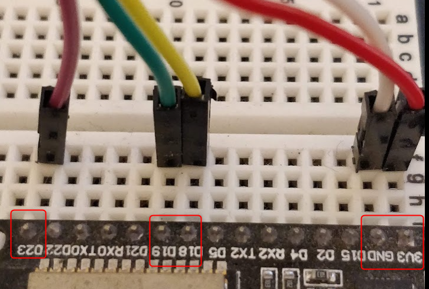

# Demo

[](https://youtu.be/FBUwIvzNVd4)

# Setup

Using a single INMP441 Microphone:

| Wire | ESP32 Pin | INMP441 Pin |
|----|----| --- |
| RED | 3v3  | VDD |
| WHITE | GND  | GND |
| YELLOW | D18 (GPIO 18)  | WS|
| GREEN | D19 (GPIO 19) | SCK |
| PURPLE | D23 (GPIO 23) | SD |
| BLUE | GND | L/R |

The blue wire pulls L/R low and activates the left
channel.

## ESP32 Pinout


## INMP441 Pinout


## I2S Configuration Block

```python

# Green Wire
bck_pin = Pin(19)

# Yellow Wire
ws_pin = Pin(18)

# Purple Wire
sdin_pin = Pin(23)

audio_in = I2S(0,
               sck=bck_pin,
               ws=ws_pin,
               sd=sdin_pin,
               mode=I2S.RX,
               bits=16,
               format=I2S.MONO,
               rate=16000,
               ibuf=16000
               )
```

