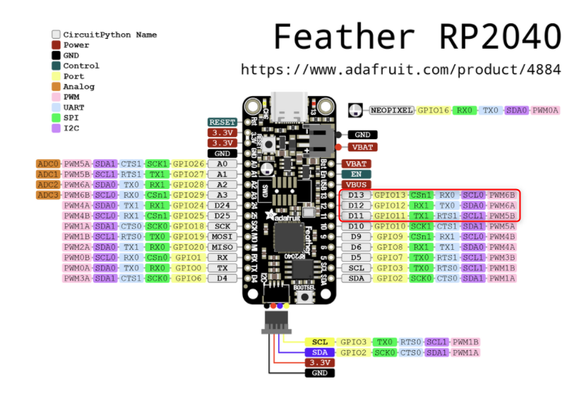
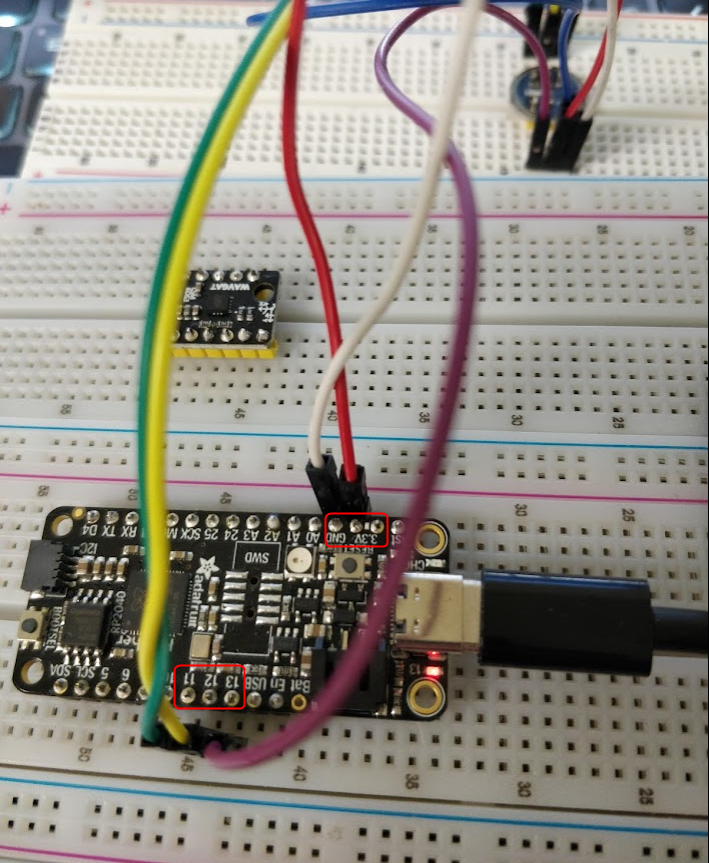
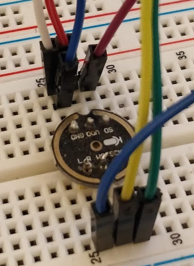

# Demo

[](https://youtu.be/MK8A4Kt1haU)


# Setup

Using a single INMP441 Microphone:

| Wire | RP2 Pin | INMP441 Pin |
|----|---------| --- |
| RED | 3v3     | VDD |
| WHITE | GND     | GND |
| YELLOW | GPIO 12 | WS|
| GREEN | GPIO 11 | SCK |
| PURPLE | GPIO 13 | SD |
| BLUE | GND     | L/R |

The blue wire pulls L/R low and activates the left
channel.

## Feather 2040 Pinout


## Feather 2040 Wiring



## INMP441 Pinout


## I2S Configuration Block

```python

# Green Wire
bck_pin = Pin(11)

# Yellow Wire
ws_pin = Pin(12)

# Purple Wire
sdin_pin = Pin(13)

audio_in = I2S(
	0,
	sck=bck_pin,
	ws=ws_pin,
	sd=sdin_pin,
	mode=I2S.RX,
	bits=16,
	format=I2S.MONO,
	rate=16000,
	ibuf=9600
)
```

