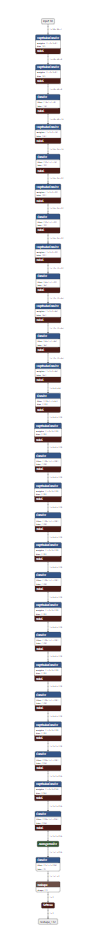
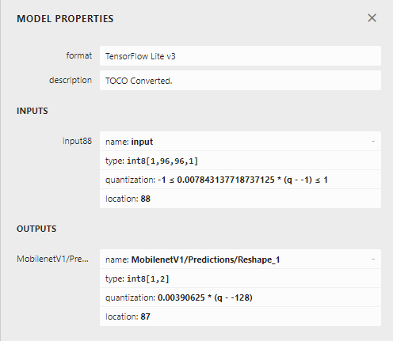
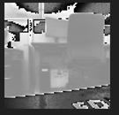
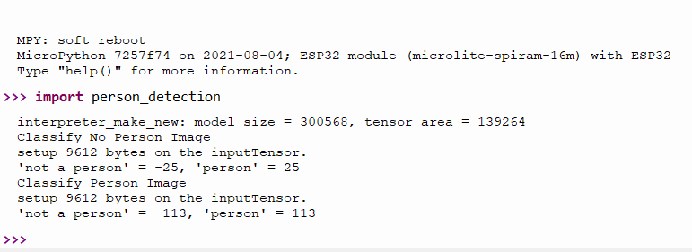

Micropython implementation of the Person Detection Example

# Model Architecture



# Model Properties


# Upstream example
https://github.com/tensorflow/tflite-micro/blob/main/tensorflow/lite/micro/examples/person_detection/README.md

# Training the model

https://github.com/tensorflow/tflite-micro/blob/main/tensorflow/lite/micro/examples/person_detection/training_a_model.md

# Files

## person_detect_model.tflite

I was able to restore the tflite model from the person_detection_int8 archive.  It was a .cc file but I converted it back into a binary file and verified the architecture in netron.


## person_image_data.dat

I was able to create this (96,96) binary file from the corresponding .cc file from the person_detection_int8 archive.


## no_person_image_data.dat

I was able to create this (96,96) binary file from the corresponding .cc file from the person_detection_int8 archive.



## show-test-images.py

A script that runs in python3 to load and display the two test images.

# Running in unix port

Download the latest build of the micropython unix port:
1. Click on "Actions" tab.
2. Click on "Select Workflow" button.
3. Choose "UNIX"
4. Click on the commit message name for the most recent successful build
5. Click on microlite-unix-micropython in the "Artifacts" area to download a zip file containing the micropython command for unix.  It can also run within the windows subsystem for linux.

Run micropython <path to tensorflow-micropython-examples> /examples/person_detection/person_detection.py

```
  ~/git/tensorflow-micropython-examples/examples/person_detection$ ./micropython ./person_detection.py
interpreter_make_new: model size = 300568, tensor area = 139264
Classify No Person Image
setup 9612 bytes on the inputTensor.
'not a person' = -25, 'person' = 25
Classify Person Image
setup 9612 bytes on the inputTensor.
'not a person' = -113, 'person' = 113
```  

# Running on ESP32 port without a camera

**NOTE: The person detection model is 300 kb so you need to use a board with SPI RAM**


Download the latest build of the micropython microlite spiram board for the esp32 port:
1. Click on "Actions" tab.
2. Click on "Select Workflow" button.
3. Choose "ESP32"
4. Click on the commit message name for the most recent successful build
5. Click on microlite-spiram-16m-esp32-firmware in the "Artifacts" area to download a zip file containing the 
   esp32 firmware you can now flash.  
   
After flashing upload these files from here onto the board:
1. no_person_image_data.dat
2. person_image_data.dat
3. person_detect_model.tflite
4. person_detection.py

Then import person_detection to run the example:


# Running on an ESP32 With a Camera

This has been tested using an ESP32-CAM-MB and an M5 Timer Camera using the 
[MICROLITE_SPIRAM_CAM](../../boards/esp32/MICROLITE_SPIRAM_CAM) Firmware.

Flash that firmware and then copy the esp32-cam/person_detection_cam.py and person_detect_model.tflite
model to the camera.

Run import person_detection_cam to activate the demo program.  The led will illuminate
when it thinks a person is in frame.